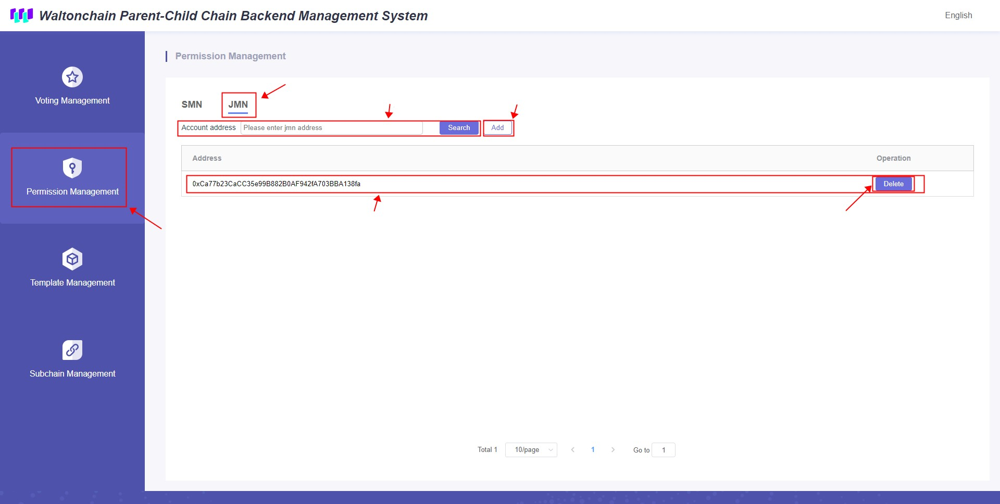

## Waltonchain Parent-Child Chain Backend Management System

### 1. System Startup
+ Enter the System State interface
+ Press "Start"

+ Enter the sender address in the pop-up box and press "Next" 

+ Confirm the information in the pop-up metamask window, press "Next" to start

+ Starts immediately when passed in "System Voting"

### 2. System Voting
+ Enter the System Voting interface
+ Press the button under the "Voting" list to cast your vote

+ Enter the sender address in the pop-up box and press "Next" 

+ Confirm the information in the pop-up metamask window, press "Next" to start

### 3. Normal Voting
Some votes need two stages, the first stage is "For" and the second stage is "Decision"
+ Enter the Mormal Voting interface
+ Press the button under the "Voting" list to cast your vote

+ Enter the sender address in the pop-up box and press "Next" 

+ Confirm the information in the pop-up metamask window, press "Next" to start

### 4. Permission Management
Permission types include JMN and SMN
1. View
	+ Enter the Permission Management interface to view the JMN list and SMN list
	
2. Add
	+ Press "Add", fill in the permission information in the pop-up window and press the "Next"
	
	+ Confirm the information in the pop-up metamask window, press "Next" to start
	+ Effective when "Normal Voting" passed
3. Delete
	+ Press "Delete", fill in the sender address in the pop-up window and press "Next"
	
	+ Confirm the information in the pop-up metamask window, press "Next" to start
	+ Effective when "Normal Voting" passed

### 5. Template Management
Endorsement contract templates can be used to deploy endorsement contract examples on the parent chain and to associate endorsement contracts with task contracts (if any)
1. View
	+ Enter the Template Management interface to view the list of contract templates
	
2. Add
	+ Press "Add", fill in the contract template information in the pop-up window and press "Confirm"
	
	+ Confirm the information in the pop-up metamask window, press "Next" to start
	+ Effective when "Normal Voting" passed

### 6. Child Chain Management
1. View
	+ Enter the Child Chain Management interface to view the list of child chains
	
2. Add
	+ Press "Add", fill in the child chain information in the pop-up window and press the "Next"
	
	+ Confirm the information in the pop-up metamask window, press "Next" to start
	+ Effective when "Normal Voting" passed
3. Enter the endorsement list
	+ Press a contract link in the "Contract" list to enter Endorsement Management

### 7. Endorsement Management
Manage endorsement information. Each endorsement list corresponds to a child chain.
1. View
	+ Enter the Endorsement Management interface to view the endorsement list
	
2. Add
	+ Press "Add", fill in the endorsement information in the pop-up window and press "Confirm"
	
	+ Confirm the information in the pop-up metamask window, press "Next" to start
	+ Effective when "Normal Voting" passed
3.  Endorsement Contract Initialization
	+ Press "Init" in the "Operation" column, fill in the endorsement contract initialization information in the pop-up window and press "Next"
	
	+ Confirm the information in the pop-up metamask window, press "Next" to start
	+ Effective when "Normal Voting" passed
4. Endorsement Contract Reward Change
	+ Press "Change Reward" in the "Operation" column, fill in the new reward information in the pop-up window, and press "Next"
	
	+ Confirm the information in the pop-up metamask window, press "Next" to start
	+ Effective when "Normal Voting" passed

## Waltonchain Parent-Child Chain Data Verification System

### 1. Search
View the contents of the source data.
+ Press the "Child Chain" drop-down button and click on the child chain you want to query
+ Press the "Contract" drop-down button and click on the child chain endorsement you want to query
+ Press "Search" to display a list of data in a contract. If you want to query specified data, you can fill in the serial number of the data in "Data Number" and press "Search"

### 2. Verify
View the endorsement data corresponding to the source data.
+ When you press "Verify" in the "Operation" column, the "Endorsement Contract Data" column displays hashes of the corresponding row. If the hash values of the "Source Data" column and the "Endorsement Contract Data" column are the same, verification is successful.
